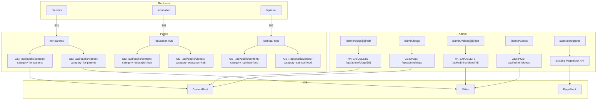

# Design Document: Content Hub Management

## Overview

This feature transforms the three "Focused Support" public pages (`/for-parents`, `/education-hub`, `/spiritual-food`) from static pages into dynamically-driven content hubs. Admins gain dedicated management pages for blog posts (`/admin/blogs`), videos (`/admin/videos`), and programs (`/admin/programs`). The Prisma schema is extended with new fields on `ContentPost` and a new `Video` model. The NavBar is updated to point to the new canonical URLs, with 301 redirects from the old paths.

The design follows two established patterns already present in the codebase:
- **Public pages**: `SubPageHero` + content grid + `CTASection` (see `/programs`, `/education`, `/spiritual`)
- **Admin pages**: `AdminSidebar` + `<main>` content area (see `app/admin/layout.tsx`)

---

## Architecture



### Key Architectural Decisions

1. **Direct DB queries on public pages** — The public hub pages (`/for-parents`, etc.) are Next.js Server Components that query Prisma directly, consistent with how `/programs/page.tsx` works. No intermediate API call is needed for SSR.
2. **Separate API routes for blogs vs. existing content** — `/api/admin/blogs` is a new route distinct from `/api/admin/content`. The existing `/admin/content` route and page remain untouched for general posts without a category.
3. **301 redirects via `next.config.js`** — Old URLs are redirected at the framework level, not via middleware, keeping it simple and cacheable.
4. **Programs reuse existing PageBlock model** — No new model needed; `/admin/programs` is a new admin page that manages `PageBlock` records with `page='programs'` and `section='program'`, replacing the current static event-only admin page for programs.

---

## Components and Interfaces

### New Public Components

#### `ContentCard`
Reusable card for rendering a `ContentPost` on any hub page.

```tsx
interface ContentCardProps {
  title: string;
  excerpt?: string | null;
  featured_image?: string | null;
  content_type: "blog" | "devotional" | "guide";
  published_at?: Date | null;
  slug: string;
}
```

Renders with `rounded-[2.5rem]` card style, a content-type badge, and a featured image if present. Devotional posts get a scripture/quote left-border accent (`border-l-4 border-wisdom-blue/20`).

#### `VideoCard`
Reusable card for rendering a `Video` on any hub page.

```tsx
interface VideoCardProps {
  title: string;
  description: string;
  thumbnail_url?: string | null;
  video_url: string;
  category: string;
  is_featured: boolean;
}
```

Renders with a play-button overlay on the thumbnail, a "Video" type badge, and a featured ribbon if `is_featured` is true.

### New Admin Components

#### `BlogPostForm`
Client component for creating/editing a `ContentPost` with the new fields. Extends the existing `ContentPostForm` pattern.

```tsx
interface BlogPostFormProps {
  postId?: string;
  defaultValues?: {
    title: string; slug: string; body: string;
    excerpt?: string | null; featured_image?: string | null;
    content_type: string; category?: string | null;
    is_published: boolean;
  };
}
```

Auto-generates slug from title (same logic as `ContentPostForm`). Includes `<select>` for `content_type` and `category`.

#### `VideoForm`
Client component for creating/editing a `Video`.

```tsx
interface VideoFormProps {
  videoId?: string;
  defaultValues?: {
    title: string; slug: string; description: string;
    thumbnail_url?: string | null; video_url: string;
    category: string; is_featured: boolean; is_published: boolean;
  };
}
```

#### `ProgramManager`
Client component for managing `PageBlock` program entries. Mirrors the `EventManager` pattern — inline form, grid of cards, up/down reorder controls.

### Updated Components

#### `AdminSidebar`
Three new entries added to `NAV_ITEMS`:
```ts
{ label: "Blog Posts", href: "/admin/blogs", icon: "FileTextIcon" },
{ label: "Videos", href: "/admin/videos", icon: "VideoIcon" },
{ label: "Programs", href: "/admin/programs", icon: "GridIcon" },
```
Active detection uses `pathname.startsWith(item.href)` for sub-routes (e.g., `/admin/blogs/new`).

#### `NavBar`
`navLinks` updated:
```ts
{ href: "/for-parents", label: "For Parents", labelAm: "ለወላጆች" },
{ href: "/education-hub", label: "Education Hub", labelAm: "የትምህርት ማዕከል" },
{ href: "/spiritual-food", label: "Spiritual Food", labelAm: "መንፈሳዊ ምግብ" },
```

---

## Data Models

### Prisma Schema Changes

#### Extended `ContentPost`

```prisma
model ContentPost {
  id             String    @id @default(cuid())
  title          String
  slug           String    @unique
  body           String
  excerpt        String?
  featured_image String?
  content_type   String    @default("blog")   // "blog" | "devotional" | "guide"
  category       String?                       // "for-parents" | "education-hub" | "spiritual-food" | null
  imageUrl       String?                       // kept for backward compat
  published      Boolean   @default(false)
  publishedAt    DateTime?
  createdAt      DateTime  @default(now())
  updatedAt      DateTime  @updatedAt
}
```

Migration is additive — `excerpt`, `featured_image`, `content_type` (with default), and `category` (nullable) are all non-breaking additions. Existing records retain `category = null` and `content_type = 'blog'`.

#### New `Video` Model

```prisma
model Video {
  id            String    @id @default(cuid())
  title         String
  slug          String    @unique
  description   String
  thumbnail_url String?
  video_url     String
  category      String    // "for-parents" | "education-hub" | "spiritual-food"
  is_featured   Boolean   @default(false)
  is_published  Boolean   @default(false)
  published_at  DateTime?
  createdAt     DateTime  @default(now())
  updatedAt     DateTime  @updatedAt
}
```

### API Response Shapes

**Blog post (admin):**
```ts
{
  id: string; title: string; slug: string; body: string;
  excerpt: string | null; featured_image: string | null;
  content_type: string; category: string | null;
  published: boolean; publishedAt: string | null;
  createdAt: string; updatedAt: string;
}
```

**Video (admin):**
```ts
{
  id: string; title: string; slug: string; description: string;
  thumbnail_url: string | null; video_url: string; category: string;
  is_featured: boolean; is_published: boolean; published_at: string | null;
  createdAt: string; updatedAt: string;
}
```

### Route Map

| Route | Method | Auth | Description |
|---|---|---|---|
| `/api/admin/blogs` | GET | ADMIN | List all ContentPost records |
| `/api/admin/blogs` | POST | ADMIN | Create ContentPost |
| `/api/admin/blogs/[id]` | GET | ADMIN | Get single ContentPost |
| `/api/admin/blogs/[id]` | PATCH | ADMIN | Update ContentPost |
| `/api/admin/blogs/[id]` | DELETE | ADMIN | Delete ContentPost |
| `/api/admin/videos` | GET | ADMIN | List all Video records |
| `/api/admin/videos` | POST | ADMIN | Create Video |
| `/api/admin/videos/[id]` | GET | ADMIN | Get single Video |
| `/api/admin/videos/[id]` | PATCH | ADMIN | Update Video |
| `/api/admin/videos/[id]` | DELETE | ADMIN | Delete Video |
| `/api/public/content` | GET | Public | Published ContentPost by category |
| `/api/public/videos` | GET | Public | Published Video by category |

### Redirect Configuration (`next.config.js`)

```js
async redirects() {
  return [
    { source: '/parents', destination: '/for-parents', permanent: true },
    { source: '/education', destination: '/education-hub', permanent: true },
    { source: '/spiritual', destination: '/spiritual-food', permanent: true },
  ];
}
```

---

## Correctness Properties

*A property is a characteristic or behavior that should hold true across all valid executions of a system — essentially, a formal statement about what the system should do. Properties serve as the bridge between human-readable specifications and machine-verifiable correctness guarantees.*

### Property 1: Published content appears on the correct public page

*For any* published `ContentPost` or `Video` with a given `category`, querying the public API with that category must include that record in the response, and must not include records from other categories.

**Validates: Requirements 3.1, 3.2, 4.1, 4.2, 5.1, 5.2**

---

### Property 2: Unpublished content is excluded from public responses

*For any* `ContentPost` or `Video` where `is_published = false` (or `published = false`), the public API endpoints (`/api/public/content`, `/api/public/videos`) must not return that record regardless of its category.

**Validates: Requirements 3.1, 3.2, 4.1, 4.2, 5.1, 5.2**

---

### Property 3: Slug uniqueness is enforced

*For any* two `ContentPost` records or two `Video` records, no two records within the same model may share the same `slug`. Attempting to create a duplicate slug must return a 409 error and leave the database unchanged.

**Validates: Requirements 1.4, 6.8, 7.8, 9.2, 10.2**

---

### Property 4: Admin-only API access

*For any* request to `/api/admin/blogs/*` or `/api/admin/videos/*` made by a user who is not authenticated or does not have the ADMIN role, the API must return a 403 (or 401) response and must not modify or return any data.

**Validates: Requirements 6.9, 7.9, 9.6, 10.6**

---

### Property 5: First-publish sets `published_at` timestamp

*For any* `ContentPost` or `Video` that transitions from `is_published = false` to `is_published = true` via a PATCH request, the `published_at` (or `publishedAt`) field must be set to a non-null timestamp. Subsequent PATCH requests that keep `is_published = true` must not overwrite the original `published_at` value.

**Validates: Requirements 6.5, 7.5**

---

### Property 6: Blog post creation round-trip

*For any* valid blog post payload submitted via `POST /api/admin/blogs`, a subsequent `GET /api/admin/blogs/[id]` must return a record whose `title`, `slug`, `content_type`, and `category` fields exactly match the submitted values.

**Validates: Requirements 6.3, 9.2**

---

### Property 7: Video creation round-trip

*For any* valid video payload submitted via `POST /api/admin/videos`, a subsequent `GET /api/admin/videos/[id]` must return a record whose `title`, `slug`, `video_url`, and `category` fields exactly match the submitted values.

**Validates: Requirements 7.3, 10.2**

---

### Property 8: Programs ordered by `order` field

*For any* set of `PageBlock` records with `page = 'programs'` and `section = 'program'`, the admin programs page and the public programs page must render them in ascending `order` value sequence.

**Validates: Requirements 8.1, 8.6**

---

## Error Handling

### API Layer

All API routes follow the existing envelope pattern: `{ data: T | null, error: { code, message, fields? } | null }`.

| Scenario | HTTP Status | Error Code |
|---|---|---|
| Unauthenticated request | 401 | `UNAUTHORIZED` |
| Non-ADMIN role | 403 | `FORBIDDEN` |
| Missing required fields | 400 | `VALIDATION_ERROR` |
| Duplicate slug | 409 | `CONFLICT` |
| Record not found | 404 | `NOT_FOUND` |
| Unexpected DB error | 500 | `INTERNAL_ERROR` |

### Public Pages

- If no published content exists for a category, the page renders an empty state section with a friendly message (e.g., "Content coming soon — check back shortly.") rather than an error.
- DB errors on public pages are caught and result in a fallback empty array, preventing page crashes.

### Admin Forms

- Client-side validation runs before submission (required fields, slug format).
- Server errors from the API (e.g., duplicate slug) are surfaced inline below the relevant field.
- Successful create/edit redirects back to the list page with `router.push` + `router.refresh()`.

---

## Testing Strategy

### Unit Tests

Focus on specific examples and edge cases:

- `slugify()` utility: verify it handles spaces, special characters, and consecutive hyphens correctly.
- `BlogPostForm` and `VideoForm`: verify that submitting an empty title shows a validation error.
- `ContentCard`: verify that a `devotional` content_type renders the scripture border accent.
- `VideoCard`: verify that `is_featured = true` renders the featured ribbon.
- Empty state: verify that the hub pages render the empty state message when the data array is empty.

### Property-Based Tests

Each property test uses a property-based testing library (e.g., **fast-check** for TypeScript) with a minimum of **100 iterations** per test.

Each test is tagged with a comment in the format:
`// Feature: content-hub-management, Property N: <property_text>`

**Property 1 test** — Generate random `ContentPost` and `Video` records with random categories. Insert a record with a specific category, query the public API for that category, and assert the record appears. Query for a different category and assert it does not appear.

**Property 2 test** — Generate random records with `is_published = false`. Query the public API and assert none of the unpublished records appear in the response.

**Property 3 test** — Generate random valid slugs. Insert a record, then attempt to insert a second record with the same slug. Assert the second insert returns 409 and the DB still contains exactly one record with that slug.

**Property 4 test** — Generate random API requests to admin routes with random (non-ADMIN) session states. Assert all return 401 or 403 and no data is returned.

**Property 5 test** — Generate random blog/video records. Perform a PATCH to set `is_published = true`. Assert `published_at` is now set. Perform a second PATCH keeping `is_published = true`. Assert `published_at` has not changed.

**Property 6 test** — Generate random valid blog post payloads. POST each, then GET by id. Assert all fields match the submitted payload.

**Property 7 test** — Generate random valid video payloads. POST each, then GET by id. Assert all fields match the submitted payload.

**Property 8 test** — Generate random sets of program `PageBlock` records with random `order` values. Assert the list endpoint returns them sorted ascending by `order`.
