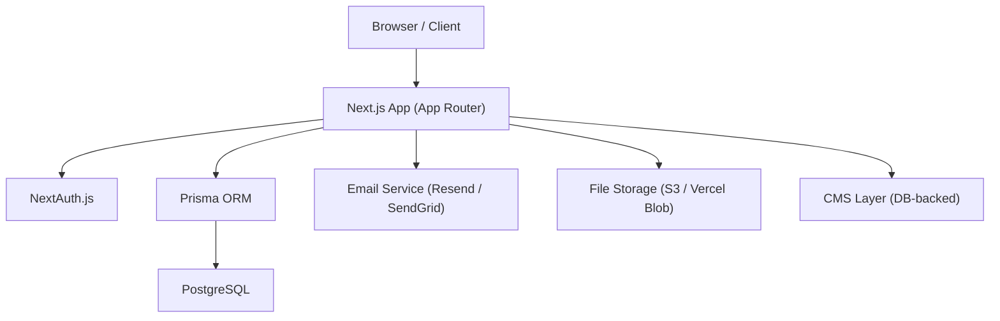

# Design Document

## Overview

Wisdom Integration is a full-stack web platform built with Next.js (App Router), TypeScript, Tailwind CSS, Prisma, and PostgreSQL. It combines a public-facing marketing site with a secure, role-based care management system serving three user groups: Parents, Therapists, and Admins.

The platform is organized as a monorepo-style Next.js application with clear separation between public routes, authenticated dashboard routes, and API routes. Authentication is handled via NextAuth.js with role-based access control enforced at both the middleware and API layers.

### Key Design Principles

- Role-based access: every authenticated route is gated by role at the middleware level
- Server-first rendering: public pages use SSG/SSR for performance; dashboards use server components with selective client interactivity
- Accessibility-first: WCAG 2.1 AA compliance is a hard requirement, not an afterthought
- Warm, trustworthy UI: rounded corners, soft color palette, large touch targets

---

## Architecture

### High-Level Architecture



### Route Structure

```
app/
  (public)/               # Public marketing site
    page.tsx              # Home
    about/
    services/
    programs/
    resources/
    contact/
    donate/
  auth/
    login/
    error/
  dashboard/
    parent/               # Role: Parent
      children/
      appointments/
      reports/
      messages/
    therapist/            # Role: Therapist
      caseload/
      schedule/
      notes/
      goals/
    admin/                # Role: Admin
      users/
      bookings/
      services/
      content/
      analytics/
  api/
    auth/[...nextauth]/
    contact/
    bookings/
    notes/
    reports/
    goals/
    users/
    analytics/
```

### Middleware

Next.js middleware (`middleware.ts`) intercepts all `/dashboard/*` routes:
1. Checks for a valid session via NextAuth
2. Reads the user's role from the session token
3. Redirects unauthenticated users to `/auth/login`
4. Returns 403 for authenticated users accessing routes outside their role

---

## Components and Interfaces

### Public Site Components

| Component | Description |
|---|---|
| `HeroSection` | Full-width hero with headline, subtext, and two CTA buttons |
| `ServicesGrid` | Card grid for the five service offerings |
| `WhyChooseUs` | Four-column feature highlight section |
| `TestimonialsCarousel` | Rotating parent/family testimonials |
| `ContactForm` | Validated contact form with inline error display |
| `Footer` | Contact info, social links, nav links, legal links |
| `NavBar` | Responsive navigation with mobile hamburger menu |

### Shared Dashboard Components

| Component | Description |
|---|---|
| `DashboardShell` | Layout wrapper with sidebar nav and top bar |
| `DataTable` | Reusable sortable/filterable table |
| `Modal` | Accessible modal dialog (focus trap, ESC close) |
| `FormField` | Labeled input with inline validation error display |
| `NotificationBadge` | Unread count indicator |
| `FileUpload` | Drag-and-drop file upload with progress |
| `PDFDownloadButton` | Triggers PDF generation and download |

### API Route Interfaces

All API routes follow a consistent response shape:

```typescript
// Success
{ data: T, error: null }

// Error
{ data: null, error: { code: string, message: string } }
```

Authentication state is read from the NextAuth session on every API route. Role is checked before any data access.

---

## Data Models

### Prisma Schema (core models)

```prisma
model User {
  id            String    @id @default(cuid())
  email         String    @unique
  passwordHash  String
  name          String
  role          Role
  active        Boolean   @default(true)
  createdAt     DateTime  @default(now())
  updatedAt     DateTime  @updatedAt

  children      ChildProfile[]   @relation("ParentChildren")
  sessions      Session[]        @relation("TherapistSessions")
  notes         SessionNote[]
  messages      Message[]
}

enum Role {
  PARENT
  THERAPIST
  ADMIN
}

model ChildProfile {
  id                String    @id @default(cuid())
  name              String
  dateOfBirth       DateTime
  diagnosisNotes    String?
  emergencyContact  String
  medicalNotes      String?
  parentId          String
  therapistId       String?
  createdAt         DateTime  @default(now())
  updatedAt         DateTime  @updatedAt

  parent            User      @relation("ParentChildren", fields: [parentId], references: [id])
  therapist         User?     @relation("TherapistCaseload", fields: [therapistId], references: [id])
  sessions          Session[]
  notes             SessionNote[]
  goals             Goal[]
  reports           ProgressReport[]
}

model Session {
  id            String        @id @default(cuid())
  childId       String
  therapistId   String
  serviceType   String
  scheduledAt   DateTime
  status        SessionStatus @default(SCHEDULED)
  createdAt     DateTime      @default(now())
  updatedAt     DateTime      @updatedAt

  child         ChildProfile  @relation(fields: [childId], references: [id])
  therapist     User          @relation("TherapistSessions", fields: [therapistId], references: [id])
  note          SessionNote?
}

enum SessionStatus {
  SCHEDULED
  COMPLETED
  CANCELLED
}

model SessionNote {
  id          String    @id @default(cuid())
  sessionId   String    @unique
  childId     String
  authorId    String
  content     String
  createdAt   DateTime  @default(now())
  updatedAt   DateTime  @updatedAt

  session     Session       @relation(fields: [sessionId], references: [id])
  child       ChildProfile  @relation(fields: [childId], references: [id])
  author      User          @relation(fields: [authorId], references: [id])
}

model ProgressReport {
  id          String    @id @default(cuid())
  childId     String
  fileUrl     String
  uploadedBy  String
  createdAt   DateTime  @default(now())

  child       ChildProfile  @relation(fields: [childId], references: [id])
}

model Goal {
  id            String    @id @default(cuid())
  childId       String
  description   String
  completed     Boolean   @default(false)
  completedAt   DateTime?
  createdAt     DateTime  @default(now())
  updatedAt     DateTime  @updatedAt

  child         ChildProfile  @relation(fields: [childId], references: [id])
}

model Message {
  id          String    @id @default(cuid())
  senderId    String
  content     String
  readAt      DateTime?
  createdAt   DateTime  @default(now())

  sender      User      @relation(fields: [senderId], references: [id])
}

model Service {
  id          String    @id @default(cuid())
  name        String
  description String
  active      Boolean   @default(true)
  createdAt   DateTime  @default(now())
  updatedAt   DateTime  @updatedAt
}

model ContentPost {
  id          String      @id @default(cuid())
  title       String
  slug        String      @unique
  body        String
  published   Boolean     @default(false)
  publishedAt DateTime?
  createdAt   DateTime    @default(now())
  updatedAt   DateTime    @updatedAt
}
```

### NextAuth Session Extension

```typescript
// types/next-auth.d.ts
declare module "next-auth" {
  interface Session {
    user: {
      id: string
      email: string
      name: string
      role: "PARENT" | "THERAPIST" | "ADMIN"
    }
  }
}
```

---

## Correctness Properties

*A property is a characteristic or behavior that should hold true across all valid executions of a system — essentially, a formal statement about what the system should do. Properties serve as the bridge between human-readable specifications and machine-verifiable correctness guarantees.*

### Property 1: Valid credentials grant role-matched access

*For any* user with valid credentials and an assigned role, authenticating should result in a session whose role field exactly matches the user's stored role, and the redirect target should be the dashboard corresponding to that role.

**Validates: Requirements 3.1, 3.2**

---

### Property 2: Invalid credentials never grant access

*For any* combination of email and password that does not match a stored credential pair, the authentication attempt should fail and no session should be created.

**Validates: Requirements 3.3**

---

### Property 3: Unauthenticated requests are redirected to login

*For any* protected dashboard route, a request without a valid session should result in a redirect to the login page, never in a successful response.

**Validates: Requirements 3.4**

---

### Property 4: Cross-role access is forbidden

*For any* authenticated user with role R, accessing a dashboard route belonging to a different role R' should return a 403 response, regardless of the specific route or user identity.

**Validates: Requirements 3.5**

---

### Property 5: Child profile creation round trip

*For any* valid child profile form submission by an authenticated parent, the created ChildProfile record should be retrievable and contain all submitted field values unchanged.

**Validates: Requirements 4.2, 4.5**

---

### Property 6: Invalid child profile forms are rejected

*For any* child profile form submission missing one or more required fields, the system should reject the submission and return validation errors identifying each missing field, leaving the database unchanged.

**Validates: Requirements 4.3**

---

### Property 7: Booking a slot creates a session and notifies

*For any* available appointment slot selected by a parent, confirming the booking should create exactly one Session record with status SCHEDULED and trigger a confirmation notification to the parent.

**Validates: Requirements 5.2**

---

### Property 8: Double-booking is prevented

*For any* appointment slot, if it has already been booked (status SCHEDULED), a subsequent booking attempt for the same slot should fail with an error and leave the existing Session unchanged.

**Validates: Requirements 5.3**

---

### Property 9: Cancellation within window removes session

*For any* upcoming Session cancelled by the parent within the permitted cancellation window, the Session status should become CANCELLED and the assigned therapist should receive a cancellation notification.

**Validates: Requirements 5.5**

---

### Property 10: Session note creation round trip

*For any* valid session note form submitted by a therapist, the saved SessionNote should be linked to the correct Session and ChildProfile and contain the submitted content unchanged.

**Validates: Requirements 8.1**

---

### Property 11: Goal completion records timestamp

*For any* Goal marked as complete, the completedAt field should be set to a non-null timestamp and the Goal should remain visible in the child's history.

**Validates: Requirements 8.5**

---

### Property 12: Deactivated users cannot authenticate

*For any* user account with active = false, an authentication attempt with valid credentials should fail and no session should be created.

**Validates: Requirements 9.3**

---

### Property 13: Deactivated services are not bookable

*For any* Service with active = false, it should not appear in the available booking slots presented to parents, and any direct booking attempt for that service should be rejected.

**Validates: Requirements 10.3**

---

### Property 14: Published content appears on public site

*For any* ContentPost with published = true, it should appear in the public Resources/Blog listing. *For any* ContentPost with published = false, it should not appear.

**Validates: Requirements 10.5**

---

### Property 15: Analytics date range filter is consistent

*For any* date range filter applied to the analytics view, every metric displayed should reflect only Sessions and users whose relevant timestamps fall within that range — no metric should include data outside the selected range.

**Validates: Requirements 11.3**

---

### Property 16: Contact form validation rejects incomplete submissions

*For any* contact form submission missing one or more required fields, the system should reject the submission, display inline errors for each missing field, and not deliver the message to the organization.

**Validates: Requirements 2.9**

---

## Error Handling

### API Error Strategy

All API routes wrap handlers in a try/catch. Errors are classified:

| Error Type | HTTP Status | User Message |
|---|---|---|
| Validation failure | 400 | Field-level messages returned in response |
| Unauthenticated | 401 | Redirect to login (middleware handles) |
| Forbidden (wrong role) | 403 | "You don't have permission to access this." |
| Not found | 404 | "The requested resource was not found." |
| Database error | 500 | "Something went wrong. Please try again." |
| Conflict (double-book) | 409 | "This slot is no longer available." |

Database errors are logged server-side (with stack trace) but the internal details are never sent to the client.

### Form Validation Strategy

- Client-side: `react-hook-form` + `zod` for immediate inline feedback
- Server-side: same `zod` schemas re-validated on the API route (never trust client)
- Errors are returned as `{ field: string, message: string }[]` and mapped to form fields

### Session Expiry

NextAuth sessions expire after a configurable TTL (default 30 days, sliding). On expiry, the middleware redirects to login. The login page displays a "Your session has expired" message when redirected with an `expired` query param.

---

## Testing Strategy

### Dual Testing Approach

Both unit/integration tests and property-based tests are required. They are complementary:

- Unit/integration tests: verify specific examples, edge cases, error conditions, and integration points
- Property-based tests: verify universal correctness properties across randomized inputs

### Unit and Integration Tests

Framework: **Jest** + **React Testing Library** for component tests; **Jest** + **supertest** (or Next.js route handlers directly) for API tests.

Focus areas:
- Authentication flow (login, logout, session expiry, role redirect)
- Form validation (valid inputs pass, invalid inputs produce correct errors)
- API route authorization (correct role passes, wrong role returns 403)
- Booking conflict detection
- Goal completion timestamp recording
- CMS publish/unpublish toggling

### Property-Based Tests

Framework: **fast-check** (TypeScript-native property-based testing library)

Configuration: minimum **100 iterations** per property test.

Each property test is tagged with a comment in the format:
`// Feature: wisdom-integration-platform, Property {N}: {property_text}`

Property test coverage map:

| Property | Test Description |
|---|---|
| P1: Valid credentials → role-matched session | Generate random valid users across all roles; verify session role matches stored role |
| P2: Invalid credentials → no session | Generate random invalid credential pairs; verify no session is created |
| P3: Unauthenticated → redirect | Generate random protected routes; verify redirect to login without session |
| P4: Cross-role → 403 | Generate random (user, route) pairs where roles don't match; verify 403 |
| P5: Child profile round trip | Generate random valid child profile data; create and retrieve; verify field equality |
| P6: Invalid profile rejected | Generate forms with random missing required fields; verify rejection and error messages |
| P7: Booking creates session | Generate random available slots; book and verify Session record and notification |
| P8: Double-booking prevented | Generate a booked slot; attempt second booking; verify failure |
| P9: Cancellation within window | Generate sessions with random future times within window; cancel and verify status |
| P10: Session note round trip | Generate random note content; save and retrieve; verify content equality |
| P11: Goal completion timestamp | Generate random goals; mark complete; verify completedAt is non-null and goal persists |
| P12: Deactivated user blocked | Generate deactivated users with valid credentials; verify auth failure |
| P13: Deactivated service not bookable | Generate deactivated services; verify absence from booking slots |
| P14: Published content visibility | Generate posts with random published state; verify public listing matches published=true only |
| P15: Analytics date range consistency | Generate sessions across random date ranges; apply filter; verify all metrics respect range |
| P16: Contact form validation | Generate forms with random missing fields; verify rejection and inline errors |

### Accessibility Testing

- **axe-core** integrated into Jest/RTL tests via `jest-axe` to catch automated WCAG violations
- Manual keyboard navigation testing for all interactive flows
- Color contrast verified at design time using the defined palette (all combinations meet 4.5:1 for normal text)

### Performance Testing

- Lighthouse CI run on public pages in CI pipeline; fail build if score drops below 80
- Database queries reviewed for N+1 issues using Prisma query logging in development
